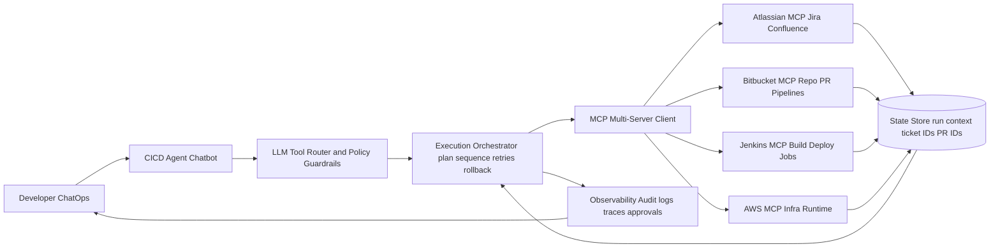

```mermaid
flowchart LR
    U[Developer ChatOps] --> C[CICD Agent Chatbot]
    C --> R[LLM Tool Router and Policy Guardrails]
    R --> O[Execution Orchestrator plan sequence retries rollback]
    O --> M[MCP Multi-Server Client]

    M --> A[Atlassian MCP Jira Confluence]
    M --> B[Bitbucket MCP Repo PR Pipelines]
    M --> J[Jenkins MCP Build Deploy Jobs]
    M --> W[AWS MCP Infra Runtime]

    A --> S[(State Store run context ticket IDs PR IDs)]
    B --> S
    J --> S
    W --> S

    S --> O
    O --> L[Observability Audit logs traces approvals]
    L --> U
```